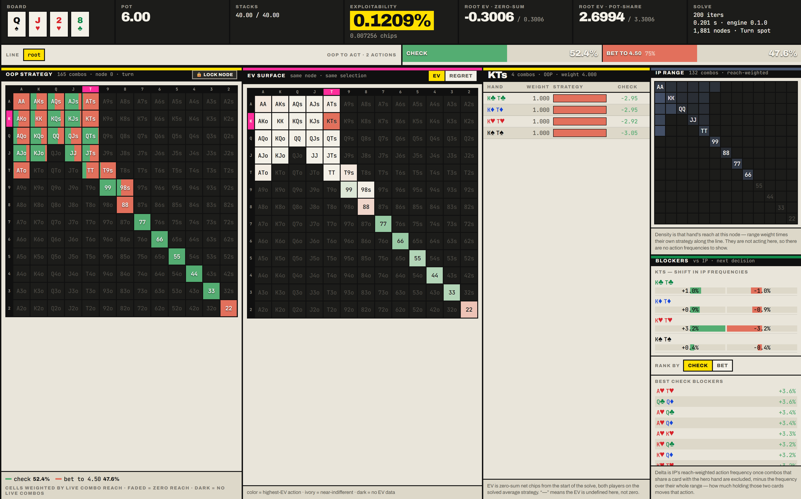
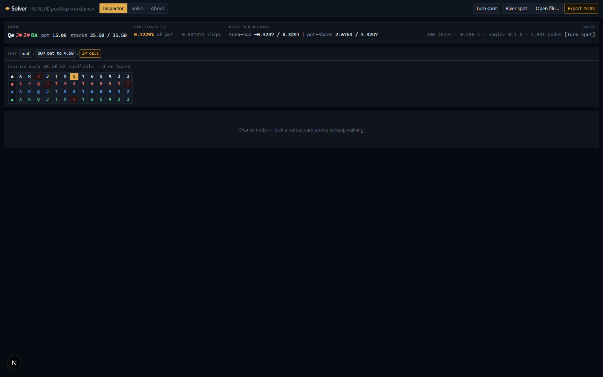

# postflop

A heads-up no-limit hold'em **postflop GTO solver**: a Rust engine implementing
vector-form Discounted CFR with a full best-response exploitability calculator,
a native CLI, WebAssembly bindings, and a browser workbench for inspecting
solutions.

**Live:** [postflop.vercel.app](https://postflop.vercel.app) ·
try the [hosted workbench](https://postflop-workbench.vercel.app), no install needed.



## What it does

Give it a flop, turn, or river spot — board, both ranges, stacks, pot, bet
sizings — and it computes an approximate Nash equilibrium with a **measured
exploitability bound**, then lets you walk the game tree: per-hand strategies,
per-hand EVs, action frequencies, and every runout.

- **Discounted CFR** (Brown & Sandholm 2019): alternating updates, α=1.5 β=0
  γ=2 (configurable), γ-weighted average strategy, optional CFR+-style regret
  floor. Full vector traversal over all hand combos — no sampling in the solve
  path.
- **Exact card removal everywhere.** Fold and showdown evaluation run O(N+M)
  sweeps with per-card weight sums and inclusion–exclusion; ties are handled as
  distinct rank groups. Blocked combos are filtered out of the working vectors
  (1176 live on a flop, 1128 turn, 1081 river), never zero-weighted.
- **Convergence is measured, never asserted.** A best-response calculator,
  separate from the CFR traversal, reports exploitability (both players'
  best-response gains) in chips and as % of pot at every report interval.
  Regret magnitude is never used as a convergence signal.
- **Deterministic parallelism.** The traversal fans out across chance-node
  runouts with rayon using a parallel-map / sequential-reduce design, so solved
  strategies are **bit-identical for every thread count**.
- **Memory-conscious.** Flat arena game tree (no pointer chasing), chance
  tables shared across betting lines by board, and an optional `i16` storage
  mode with per-node scale factors that roughly halves peak memory.

## Workspace

```
engine/   the solving library
  cards, range     1326-combo weighted ranges, standard + PioSOLVER notation
  evaluator        7-card hand evaluation (77M evals/sec measured, oracle-verified)
  tree, config     TOML solve spec -> arena betting/chance tree
  terminal         O(N+M) fold/showdown sweeps with exact blocker handling
  game, cfr, br    Game trait, DCFR solver, best-response exploitability
  nlhe             the concrete NLHE game
  iso              suit isomorphism: 22,100 flops -> 1,755 canonical classes
  solution         versioned solution file format with a structure guard
  games/           Kuhn poker + AKQ toy games used to validate the CFR core
cli/      `solver` binary: solve + show
wasm/     the engine compiled to WebAssembly
web/      Next.js browser workbench
```

## Quick start

Requires Rust (stable). For the web UI: Node 20+, `wasm-pack`.

The fastest way in — builds whatever is missing, starts the workbench, and
opens your browser:

```sh
python launch.py
```

Or by hand:

```sh
cargo build --release
```

### Solve a spot

A spot is a TOML file plus optional CLI overrides:

```toml
board = "Qs Jh 2h"
oop_range = "22+,ATs+,KTs+,QTs+,JTs,T9s,98s,ATo+,KJo+"
ip_range = "66+,A9s+,KTs+,QTs+,JTs,ATo+,KQo"
effective_stack = 40.0
starting_pot = 6.0
max_iterations = 600
target_exploitability = 0.5   # stop at 0.5% of pot

[sizings.oop.flop]
bet = { percents = [50.0], allin = false }
[sizings.ip.flop]
bet = { percents = [50.0], allin = false }
raise = { percents = [60.0], allin = false }
# ... per street, per player, separately for bet / raise / donk
```

```sh
solver solve --config spot.toml --report-every 100 --out solution.json
```

```
iter      100  exploitability 0.024258 chips  0.4043% of pot  [measured]
iter      200  exploitability 0.007256 chips  0.1209% of pot  [measured]
=== final report ===
OOP EV: zero-sum -0.3006  pot-share 2.6994  [measured]
IP  EV: zero-sum 0.3006  pot-share 3.3006  [measured]
```

Flags: `--board`, `--oop-range`, `--ip-range`, `--stack`, `--pot`,
`--max-iterations`, `--target-exploitability`, `--report-every`, `--threads`,
`--storage f32|i16`, `--out`. Every printed exploitability and EV figure comes
straight out of the best-response calculator against the current average
strategy — the `[measured]` tag is literal.

Config also supports: all-in threshold (sizings near a shove collapse into the
shove), raise cap, rake (percent + cap, default zero), DCFR α/β/γ, and
`regret_floor`.

### Node locking

Freeze a strategy at any decision node — per-action frequencies or a full
per-combo distribution — and the solver computes the equilibrium of the rest of
the tree conditional on that play ("villain never bluffs this river"):

```toml
[[locks]]
line = "check,bet:50"      # the node, as an action line from the root
player = 1                 # whose strategy is frozen (0 = OOP, 1 = IP)
freqs = [0.0, 1.0]         # one probability per action, or `strategy = [...]`
                           # for a full per-combo distribution
```

Locks travel inside the solution file (format v2; lock-free solves still write
v1), the structure guard holds stored strategies to them, and reported
exploitability is measured against the locked profile — the locked player
cannot deviate at locked nodes, the other player best-responds normally.

### Inspect a solution

```sh
solver show --solution solution.json --line "check,bet:50,call"
solver show --solution solution.json --line "check,bet:50" --combo AhKh
```

`show` never re-solves: it rebuilds the deterministic tree from the embedded
config, validates the file against it, and renders a 13×13 rank grid (or one
combo's full action distribution).

### Browser workbench

Hosted at [postflop-workbench.vercel.app](https://postflop-workbench.vercel.app),
or run it locally:

```sh
wasm-pack build wasm --target web --out-dir pkg
cd web && npm install && npm run dev    # http://localhost:3000
```

Load a solution produced by the CLI (or one of the bundled sample spots), or
solve small spots directly in the browser — the engine runs in a Web Worker
with a live exploitability curve and a memory preflight. The inspector gives
you the 13×13 grid with stacked action-frequency bars weighted by live combo
reach, per-combo drill-down with per-hand EVs, a tree navigator, a 52-card
runout selector, and JSON export that round-trips through both the browser and
the CLI. The browser build is single-threaded; the CLI uses every core.

On top of that:

- **EV and regret grid overlays** — color the grid by highest-EV action per
  hand (fading to white where actions are indifferent) or by the chips lost
  taking the worse action.
- **Blocker scores** — how holding your two cards shifts the opponent's action
  frequencies at this node, plus a ranking of your range by blocker effect.
- **Runout hotness** — the turn/river card selector colored green/red by how
  each runout shifts hero EV (range-wide or for one selected combo), with
  arrow-key stepping between sibling runouts.
- **Trainer** — self-contained: pick a sample spot or set up any board, ranges
  and stacks right in the tab, and it starts dealing the moment the solve
  converges. Answer and get graded by EV loss (Best → Blunder tiers) with a
  running session score and a worst-hands-first review list. Filters for seat,
  "close decisions only", and an exact hand of your choice (type `AhKd` and
  every deal holds it).
- **Node locking** — lock the inspected node to its displayed strategy, then
  re-solve to see the exploit; pending locks are validated against the spot
  they were captured on.
- **Deep links** — the tab, node, and selected combo live in the URL, so any
  view is shareable and survives reload.



## Correctness

The engine was validated through four gated milestones, in order, each with
its committed test evidence:

1. **Kuhn poker** — converges to the known analytic equilibrium family
   (exploitability 0.002% of pot; K-bet = 3× J-bet; game value −1/18).
2. **AKQ half-street game** — matches the closed-form equilibrium derived from
   the indifference conditions, including the boundary case B ≥ P where the
   Nash set is a segment rather than a point.
3. **River spot** — indifference conditions verified against hand algebra for
   named combos (bluff EV = check EV, call EV = fold EV within 1e-3), bluff
   ratio 1/3 and MDF 1/2 recovered on a blocker-free construction.
4. **Full flop spot** — 830k-node tree, exploitability falls monotonically
   (decade envelope) from 16.5% to 0.22% of pot, zero-sum to 7e-7,
   bit-identical across 1/8/24-thread pools.

Beyond the milestones: the 7-card evaluator is verified against a slow
reference on 1,000,000 random hands *and* exhaustively on all 2,598,960
five-card hands (zero mismatches); the terminal sweeps are property-tested
against naive O(N·M) oracles at full 1081-combo width; suit isomorphism is
exhaustively checked over all 22,100 flops; and a fixed-point regression pins
chance-edge weighting to per-pair conditional probabilities (a spot holding an
unbeatable royal flush solves to exactly +half-pot at flop, turn, and river
starts).

Approximations are labeled as approximations: `i16` storage documents its
quantization floor, and the config's `turn_chance_sampling` flag is
**refused** by the CLI until an exact-labeled sampling mode exists — the
solver never silently approximates.

## Measured performance

All numbers measured on a 24-logical-core Windows machine (see the benchmark
harnesses in `engine/examples/`; nothing here is estimated):

| Workload | Result |
| --- | --- |
| 7-card evaluation | 77M evals/sec (10M-hand pool, best of 3 passes) |
| Full flop solve (830k nodes, 305v196 combos) | 2524 ms/iter @ 1 thread → 370 ms/iter @ 24 (6.8×) |
| Peak memory, same spot | 1513 MB (f32 storage; ~0.52× with `--storage i16`) |
| Turn spot (1,881 nodes) to 0.12% of pot | 0.2 s |
| Toy river spot, 20k iterations + 200 BR reports | 32 ms |

```sh
cargo run -p engine --release --example solve_flop -- engine/examples/configs/milestone4.toml 400
```

## Tests

```sh
cargo test --release --workspace
cd web && npm test               # web unit tests (grid/range/trainer/config math)
# heavyweight, run explicitly:
cargo test -p engine --release verify_1m -- --ignored --nocapture   # evaluator vs oracle, 1M hands
cargo test -p engine --release milestone4 -- --ignored --nocapture  # full flop solve (~3 min, ~1.5 GB)
```

## Not yet implemented

Aggregate reports across the 1,755 canonical flops, and preflop solving (which
needs bunching effects, heavier abstraction, and disk-backed storage — a
separate project by design).

## License

MIT
